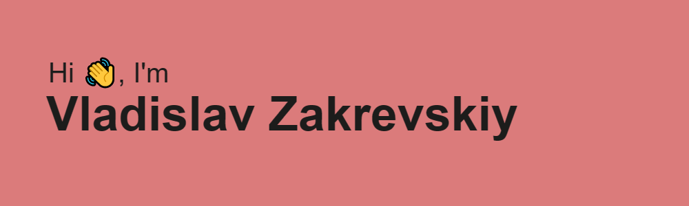

<h1 align="center">Hi there, I'm <a href="//my stat//" target="_blank">Frontender</a> 
</h1>
<h3 align="center">Web-development and some Back-end, Computer Science from Russia 🇷🇺</h3>
Hello, I'm frontend developer
My stack ( some project with these technologies you can watch in my repositories ):

<h4>Javascript/Typescript</h4>
<h4>CSS/SCSS</h4>
<h4>HTML5</h4>
<h4>React (tsx and jsx)</h4>
<h4>RTK/RTK Query/React Query ( know zustand )</h4>
<h4>Material UI/Bootstrap</h4>
<h4>Vite/some Webpack</h4>
<h4>base of git and GitHub</h4>
<h4>My Backend: Nodejs/Express/PostgreSQL/TGbots/some libries</h4>

